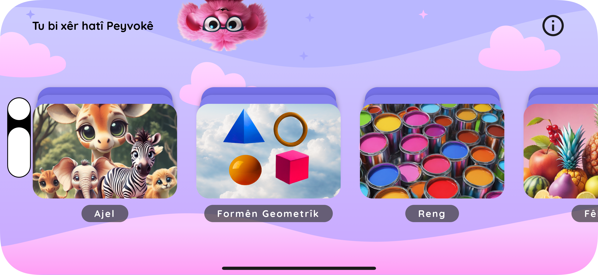
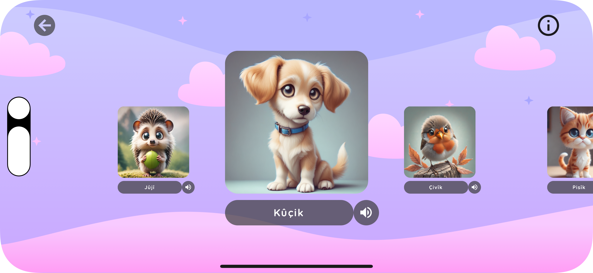

This is a new [**React Native**](https://reactnative.dev) project, bootstrapped using [`@react-native-community/cli`](https://github.com/react-native-community/cli).

# About this project

This project is a React Native mobile application developed as final project for my Frontend Development education at Medieinstitutet in Stockholm 2022-2024.

Introducing a mobile digital dictionary designed for kids to practice Northern Kurdish also known as Kurmancî. Tailored to assist parents raising bilingual children, the app features a collection of visual and audible content, encompassing various lexical categories. Each word within the application is accompanied by a vibrant image, informative text, and an audio file pronouncing the word in Kurdish. With a simple click, users can effortlessly immerse their children in the rich sounds of the Kurdish language, fostering a seamless bilingual learning experience.

## Images





# Getting Started

> **Note**: Make sure you have completed the [React Native - Environment Setup](https://reactnative.dev/docs/environment-setup) instructions till "Creating a new application" step, before proceeding.

## Step 1: Start the Metro Server

First, you will need to start **Metro**, the JavaScript _bundler_ that ships _with_ React Native.

To start Metro, run the following command from the _root_ of your React Native project:

```bash
# using npm
npm start

# OR using Yarn
yarn start
```

## Step 2: Start your Application

Let Metro Bundler run in its _own_ terminal. Open a _new_ terminal from the _root_ of your React Native project. Run the following command to start your _Android_ or _iOS_ app:

### For Android

```bash
# using npm
npm run android

# OR using Yarn
yarn android
```

### For iOS

```bash
# using npm
npm run ios

# OR using Yarn
yarn ios
```

If everything is set up _correctly_, you should see your new app running in your _Android Emulator_ or _iOS Simulator_ shortly provided you have set up your emulator/simulator correctly.

This is one way to run your app — you can also run it directly from within Android Studio and Xcode respectively.

# Troubleshooting

If you can't get this to work, see the [Troubleshooting](https://reactnative.dev/docs/troubleshooting) page.
